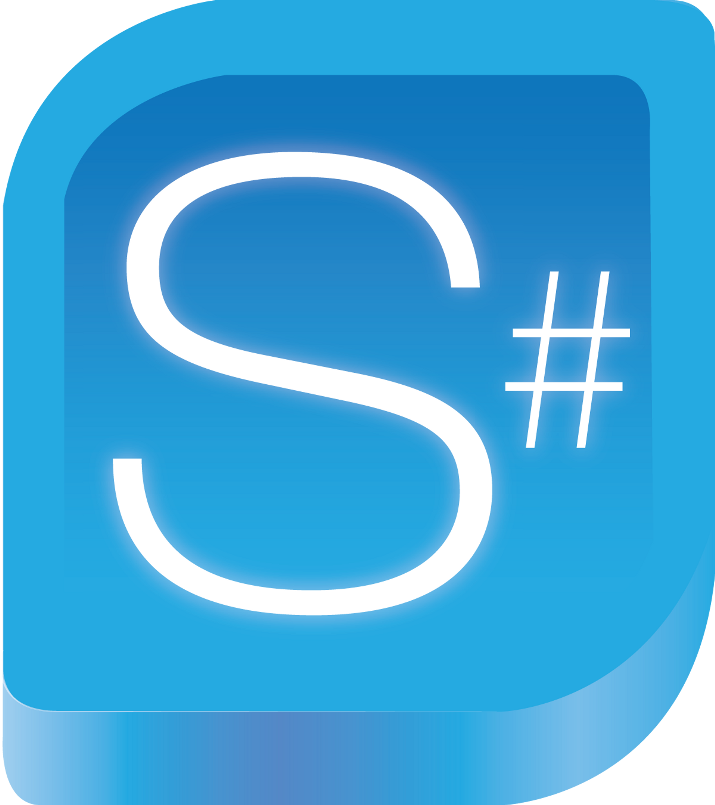

# NAVFoundation.SimplSharp

    

---

---

A collection of helper classes and utilites for SimplPlus.

## Contents 📖

-   [LICENSE :balance_scale:](#license-balance_scale)

## LICENSE :balance_scale:

[MIT](LICENSE)
